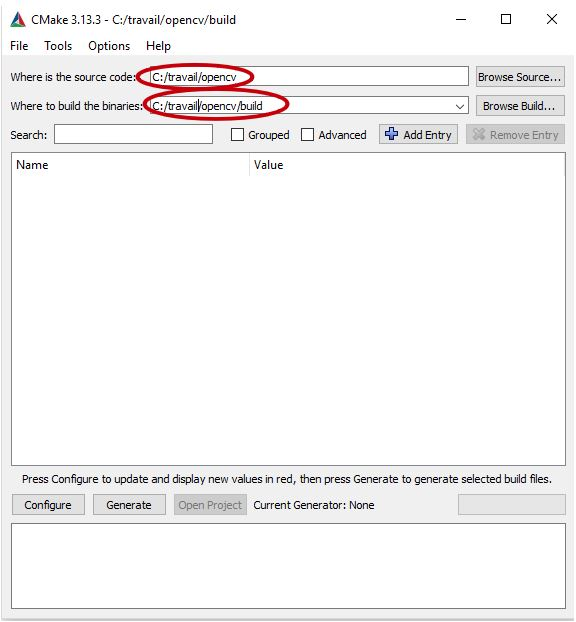
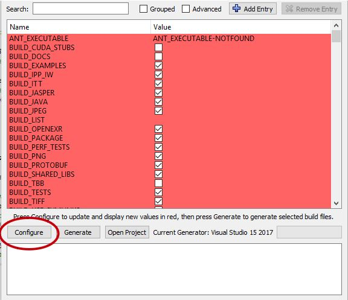
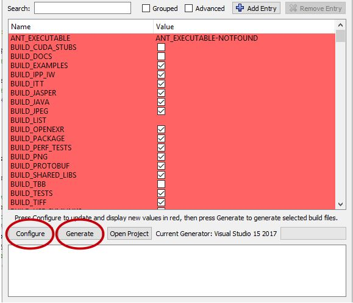
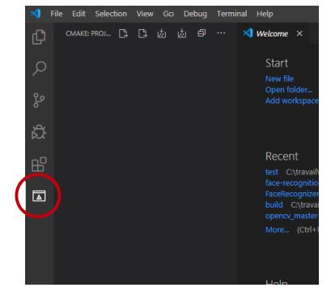
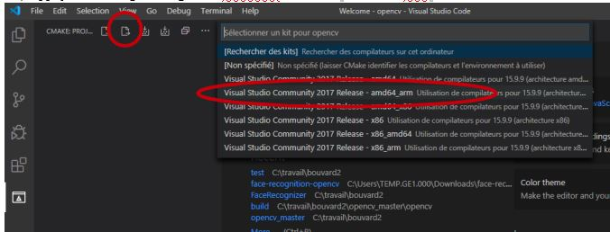
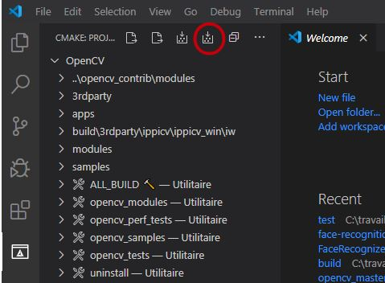
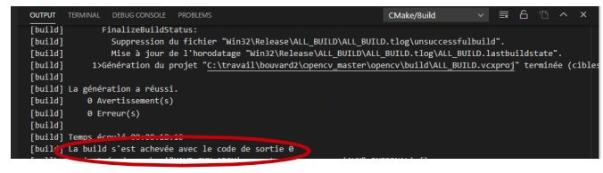
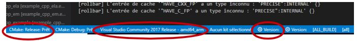

# Projet de S4-TI - détection de visages
# Installer Opencv et ses exemples avec CMake,
Prérequis :
 
Télécharger Opencv : https://github.com/opencv/opencv

Télécharger Opencv_contrib : https://github.com/opencv/opencv_contrib 

Télécharger  Cmake gui :  https://cmake.org/download/ 

Télécharger VSCode : https://code.visualstudio.com/download 

## 1) Ouvrir Cmake gui et chercher votre fichier Opencv et votre Build.

 
 
 

## 2) Configurer Opencv.

 
 
 

## 3) Changer les paramètre suivant, vous pouvez vous aider de la barre de recherche.

 
 
 

## 4) Reconfigurer et générer Opencv paramétré.

 
 
 

## 5) Maintenant nous allons aller sur VS Code afin d’installer les modules complémentaire de Opencv. Ouvrir Opencv dans VS Code et installer les extensions CMake proposées.

 
 
 

## 6) Appuyer sur le logo configure et choisisser le mode "...amd64_arm"

 
 
 

## 7) Apres la configuration appuyer sur le logo build.

 
 
 

## 8) Si le terminal affiche La build s'est achevée avec le code de sortie 0  vous avez terminer! Opencv et Opencv_contrib sont opérationnels.

 
 
 

## 9) Si le terminal affiche La build s'est achevée avec le code de sortie 1  cela signifie une erreur, alors aller dans le fichier .\opencv\build\bin et supprimer tout ce qui si trouve, vérifier les étapes précédente, notamment les erreurs qui peuvent être indiquer dans les terminaux et refaite la procédure depuis le début. Pour la partie sur VS Code vous pouvez aussi utiliser les touches suivantes :

 
 
 